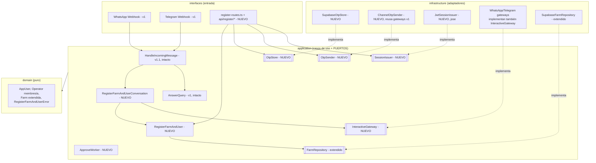

# Arquitectura — PorcIA v1.2 · Identidad, registro y giro al eje de datos

> **Propósito.** Este documento extiende `arquitectura.md` (v1, asesor de conocimiento por voz) y `arquitectura-v1.1.md` (módulo de gestión de granja). Formaliza el **giro de producto**: la **captación de datos productivos de la granja pasa a ser el eje central**; el asesor de conocimiento pasa a ser una **capacidad secundaria** que coexiste con él. La puerta de entrada a ese eje es la identidad explícita: registro de usuario + granja.
>
> **Regla base (heredada y vinculante):** v1.2 **no reemplaza** nada. Todo lo nuevo entra como **casos de uso + puertos + adaptadores nuevos**, según `arquitectura.md` §17: *"agregar = escribir un adaptador nuevo; nunca modificar el núcleo."*

---

## 0. Relación con v1 y v1.1 (inversión de jerarquía)

| Versión | Eje del producto | Estado |
|---|---|---|
| v1 | Asesor de conocimiento por voz (`AnswerQuery` + RAG) — stateless, anónimo | En producción |
| v1.1 | Asesor + módulo granja que "coexiste" (captura de eventos, inventario) | Corte 0/1 código-completo; migración `0003` sin aplicar; **sin usuarios reales** |
| **v1.2** | **Captación de datos productivos = eje central.** El asesor queda como capacidad secundaria, una rama más de `HandleIncomingMessage` | Este documento |

**Qué se conserva intacto (sin tocar una línea):**

- `domain/query/`, `domain/knowledge/`, `domain/safety/` y el caso de uso `AnswerQuery` (v1).
- El pipeline RAG completo: `PgVectorRetriever`, `LlmEmbedder`, `LlmAnswerGenerator`, `RuleBasedSafetyPolicy`, `knowledge_chunk`, `scripts/ingest-knowledge.ts`.
- Los puertos de v1 (`Transcriber`, `SpeechSynthesizer`, `KnowledgeRetriever`, `Embedder`, `AnswerGenerator`, `SafetyPolicy`, `ChannelGateway`, `ConversationLog`) y sus adaptadores.
- Los casos de uso de v1.1: `HandleIncomingMessage`, `LogFarmEvent`, `ConfirmFarmEvent`, `QueryFarmState`, y sus puertos.
- Los principios de `arquitectura.md` §3 (hexagonal, SOLID, TS estricto, `Result<T,E>`, config validada con zod, fail-fast).

**Qué se retira:** el caso de uso `RegisterFarm` de v1.1 (onboarding mínimo "nombre + operario") se **reemplaza** en el cableado por el nuevo flujo conversacional de registro (spec `003`). Como el Corte 0/1 nunca llegó a producción, se elimina del árbol y se documenta en `PROGRESO-v1.1.md`.

---

## 1. Qué agrega v1.2 (resumen ejecutivo)

1. **Identidad explícita.** El sistema deja de ser anónimo: aparece la **persona** (`AppUser`) con identificación real, y la pertenencia a granjas se modela como **membresía** (`Operator` = usuario × granja × rol).
2. **Registro de usuario + granja** (`RegisterFarmAndUser`): un solo caso de uso agnóstico de canal, expuesto por tres adaptadores — conversacional WhatsApp, conversacional Telegram, y API HTTP para la web.
3. **Autenticación para la web:** OTP de 6 dígitos enviado por WhatsApp/Telegram + **sesión propia** (JWT) emitida por el backend. En los canales de chat **no hay OTP**: la posesión del número la verifica el propio canal.
4. **Front de registro** (`app/`, repo `porcia-app`): wizard React que implementa el diseño `Registro.dc.html` (ver §10).
5. **Multi-granja y equipo:** un dueño puede registrar varias granjas; un trabajador puede solicitar unirse a una granja existente (con aprobación del dueño) o ser invitado por el dueño.

---

## 2. Decisiones de alcance (cerradas)

| # | Decisión | Resolución |
|---|---|---|
| 1 | Flujo de trabajo | **Spec primero.** Cada feature se especifica en `specs/`, se aprueba, y solo después se implementa. |
| 2 | Auth web | OTP por WhatsApp/Telegram + sesión JWT propia. Token en `localStorage`, header `Authorization: Bearer`. |
| 3 | Auth chat | **Sin OTP.** El canal ya prueba la posesión del número (`channelUserId`). Identidad por `channel_user_hash` (HMAC + `USER_ID_SALT`, mecanismo existente). |
| 4 | Canales de registro | Un caso de uso (`RegisterFarmAndUser`), tres adaptadores: conversacional WhatsApp/Telegram + formulario web. |
| 5 | Multi-granja | **Sí desde v1.2.** Una persona puede registrar/administrar varias granjas. Unicidad por combinación (usuario, granja), no global. |
| 6 | Trabajadores | **Incluidos.** Dos vías: el trabajador busca la finca y solicita unirse (membresía `pendiente` → aprueba el dueño), o el dueño lo invita durante/después del registro (membresía pre-aprobada que se activa cuando el trabajador se registra). |
| 7 | Roles | Renombrados: `'administrador_dueno' | 'trabajador'` (antes `'admin' | 'operario'`). Sin datos reales en producción → riesgo bajo. |
| 8 | Alcance del front | **Solo registro** (wizard + perfil de solo lectura post-registro). Sin dashboard. La edición de datos queda fuera de v1.2. |

---

## 3. Vista de 10 segundos (v1.2)

```
            CHAT (WhatsApp / Telegram)                      WEB (app/, React)
                     │                                            │
                     ▼                                            ▼
        [Canal] → [Router de intención]                [API HTTP /register/*]
                     │                                            │
        intent=onboarding → conversación                 formulario + OTP
        paso a paso (sin OTP, el canal                   (OtpSender → código por
        ya verificó el número)                            WhatsApp/Telegram)
                     │                                            │
                     └────────────► RegisterFarmAndUser ◄─────────┘
                                    (caso de uso único)
                                          │
                              AppUser + Farm + Operator (membresía)
                                          │
                              (web) SessionIssuer → JWT
```

Todo lo que está entre corchetes es un **puerto** o un adaptador de entrada. El caso de uso no sabe qué es OTP ni qué es una conversación: la verificación de posesión del celular es responsabilidad del **adaptador** (web verifica OTP antes de invocar; chat confía en el canal).

---

## 4. Vista de componentes (añadidos de v1.2)



> **Punto clave:** `HandleIncomingMessage` no se modifica. El adaptador conversacional de registro implementa la misma forma estructural (`handle(channelUserHash, text): Promise<FarmReply>`) que el orquestador ya espera para la rama de onboarding — solo cambia qué instancia se inyecta en `config/container.ts`.

---

## 5. Modelo de identidad multi-granja

v1.1 modelaba `Operator` como "un número = una persona = una granja". v1.2 separa **persona** de **membresía**:

- **`AppUser`** (persona) — `{ id, identificationType: 'CC'|'CE'|'PA', identificationNumber, phone, channel: 'whatsapp'|'telegram', channelUserHash, email?, displayName?, createdAt }`. El `channelUserHash` (HMAC + `USER_ID_SALT`, el mecanismo de siempre) es único por persona y sigue siendo la llave de resolución de identidad en chat.
- **`Operator`** (membresía) — `{ id, userId, farmId, role: 'administrador_dueno'|'trabajador', status: 'activo'|'pendiente', createdAt }`. Único por `(userId, farmId)`.
- **`Farm`** (extendida) — se agregan: `legalType: 'natural'|'juridica'`, `taxIdType: 'cedula'|'nit'`, `taxId`, `location`, `cebaCapacity`, `breedingCapacity`, `totalCapacity`, `sanitaryRegistry`.

**Regla de granja activa (chat):** si un usuario tiene una sola membresía activa, esa es su granja. Si tiene varias, el sistema pregunta a cuál se refiere y recuerda la última usada. El detalle es el spec `006-seleccion-granja-activa` — hasta entonces, los flujos v1.1 operan sobre la única granja o la última activa.

**Unicidad:**
- `(identification_type, identification_number)` único en `app_user` — una persona, una cuenta.
- `email` único en `app_user` (índice `app_user_email_idx on (lower(email))`, migración 0006) — es identificador de login. El caso de uso lo consulta antes de insertar y responde `duplicate_email` (409); si no, el choque saldría como fallo de persistencia (500). Ver spec 013 §4.2.
- `(user_id, farm_id)` único en `operator` — una membresía por granja.
- `phone_hash` **no** es único a propósito: dos personas pueden *afirmar* el mismo celular mientras ninguna lo pruebe. Solo la columna **probada** (`channel_user_hash`) da acceso.
- `tax_id` de `farm` **no** es único global (multi-granja: la misma cédula/NIT puede tener varias fincas). Lo que se impide es que la misma persona registre dos veces la **misma** finca (mismo `tax_id` + mismo nombre).

**Regla de "misma persona" (spec 013 §4.1, vinculante).** Que la identificación ya exista no basta para tratar el intento como multi-granja: hay que **demostrar** ser el titular, y solo hay dos pruebas válidas — (1) el `channel_user_hash` de la cuenta coincide con el canal de quien escribe, o (2) la cuenta aún no tiene canal atado y este intento verifica justo el celular que ella declaró (`phone_hash`). Todo lo demás es `duplicate_identification`. Sin esta regla, y como el adaptador web manda siempre `phoneVerified:false` (ninguna cuenta creada por web tiene `channel_user_hash`), bastaba conocer una cédula ajena para que el registro agregara la finca a esa cuenta y devolviera un JWT con el `userId` de su dueño.

---

## 6. Puertos nuevos (contratos TypeScript)

Firmas mínimas; tipos auxiliares en `domain/`. Mismo `Result<T, E>` de v1.

```ts
// application/ports/otp-store.ts
// La llave es el DESTINO, no el transporte: un mismo celular verificado por
// SMS o por WhatsApp es la misma verificación.
export interface OtpKey { readonly destination: string; } // celular E.164 o correo en minúsculas

export type OtpVerifyStatus = 'verified' | 'invalid_code' | 'expired' | 'not_found' | 'too_many_attempts';

export interface OtpStore {
  saveCode(key: OtpKey, codeHash: string, ttlSeconds: number, maxAttempts: number): Promise<Result<void, PersistenceError>>;
  verifyCode(key: OtpKey, code: string): Promise<OtpVerifyStatus>;
  isVerified(key: OtpKey, graceSeconds: number): Promise<boolean>;
  consume(key: OtpKey): Promise<void>;
}

// application/ports/otp-sender.ts   (enrutador de transportes)
export type OtpTransport = 'whatsapp' | 'telegram' | 'sms' | 'email';
export interface OtpSendError { readonly kind: 'send_failed' | 'channel_not_configured'; readonly message: string; }
export interface OtpTransportSender {
  readonly transport: OtpTransport;
  isConfigured(): boolean;
  send(destination: string, code: string): Promise<Result<void, OtpSendError>>;
}
export interface OtpSender {
  availableTransports(): readonly OtpTransport[];
  sendCode(transport: OtpTransport, destination: string, code: string): Promise<Result<void, OtpSendError>>;
}

// application/ports/session-issuer.ts
export interface SessionClaims { readonly userId: string; readonly operatorId: string; readonly farmId: string; readonly role: string; }
export interface SessionError { readonly kind: 'invalid' | 'expired'; readonly message: string; }
export interface SessionIssuer {
  issue(claims: SessionClaims, ttlSeconds: number): string;
  verify(token: string): Result<SessionClaims, SessionError>;
}

// application/ports/interactive-gateway.ts   (mensajes con botones / listas)
export interface InteractiveGateway {
  supportsInteractive(): boolean;
  sendInteractive(message: InteractiveMessage): Promise<Result<void, ChannelError>>;
}
// domain: ReplyOption      = { id: string; label: string }   // id namespaced: 'reg:tipo_persona:natural'
// domain: InteractiveMessage = { channel, channelUserId, body: string,
//                                options: ReplyOption[], layout: 'buttons' | 'list' }
```

- `ChannelOtpSender` construye un `OutgoingMessage` de texto y lo envía por el `ChannelGateway` correspondiente — **reutiliza `WhatsAppGateway`/`TelegramGateway` sin tocarlos**.
- `InteractiveGateway` es un puerto **separado** de `ChannelGateway` (ISP): los gateways de WhatsApp y Telegram lo implementan **además** del contrato de v1, sin modificar `ChannelGateway` ni `OutgoingMessage`. WhatsApp mapea a *reply buttons* (máx. 3, etiqueta ≤ 20 chars) y *list messages*; Telegram a *inline keyboards*. Un canal que no lo implemente sigue funcionando: el orquestador consulta `supportsInteractive()` y degrada a texto con opciones numeradas.
- **La pulsación entrante no cambia el dominio:** el webhook traduce `interactive.button_reply.id` (WhatsApp) o `callback_query.data` (Telegram) a un `IncomingMessage` de texto cuyo contenido es el id de la opción. El caso de uso resuelve primero por id y solo después por texto libre — así el mismo código sirve para botón, texto y voz transcrita.
- `JwtSessionIssuer` usa `jose` (ESM nativo, coherente con `"type": "module"`).
- `FarmRepository` se **extiende** (aditivo) con: `findUserByIdentification`, `findUserByHash`, `findFarmsByUser`, `searchFarms(query)`, `registerFarmAndOperator(farm, user, operator)` (atómico), `createPendingWorker`, `createWorkerInvitations`, `approveWorker`.

---

## 7. Casos de uso nuevos

- **`RegisterFarmAndUser`** — el núcleo. Recibe los datos completos (usuario + granja, o usuario + granja destino para trabajador), valida reglas de negocio (duplicados, membresía existente) y persiste atómicamente. **No verifica OTP** — eso es del adaptador web. **No sabe de conversaciones** — eso es del adaptador de chat.
- **`RegisterFarmAndUserConversation`** — adaptador conversacional multi-turno (chat). Pregunta campo a campo, guarda progreso en `PendingEventStore` (variante nueva de `PendingDraft`), confirma el resumen y llama a `RegisterFarmAndUser.submit()`. Reemplaza a `RegisterFarm` en el cableado de onboarding.
- **`ApproveWorker`** — el dueño aprueba/rechaza una solicitud de trabajador (por chat: "sí"/"no" a la notificación; por web futura: endpoint).

---

## 8. Autenticación: OTP + sesión web

- **Chat:** sin OTP cuando el canal prueba el número. En **WhatsApp** el `channelUserId` **es** el celular en E.164, así que se toma de ahí y queda verificado. En **Telegram** el `channelUserId` es un id interno, no un teléfono: se usa el botón nativo `request_contact` para que Telegram entregue el número ya verificado. Un celular que la persona *escriba* y que no coincida con el detectado sí exige OTP.
- **Web:** flujo de 3 pasos — `request-otp` (genera código de 6 dígitos, guarda **solo el hash**, lo envía por el transporte elegido) → `verify-otp` (valida con contador de intentos) → `register` (el adaptador comprueba `isVerified` dentro de la ventana de gracia antes de invocar el caso de uso; al éxito emite JWT).
- **Transportes:** WhatsApp y Telegram (gateways de v1), **SMS vía Twilio** (API HTTP, sin SDK) y **correo vía SMTP** (nodemailer). El motor de códigos es propio; los proveedores solo transportan. SMS es el único que alcanza un número que nunca escribió al bot — WhatsApp exige una *authentication template* aprobada por Meta para iniciar conversación fuera de la ventana de 24 h, y un bot de Telegram no puede escribirle a un teléfono desconocido.
- **Qué queda verificado:** el destino, no el transporte. Verificar el correo habilita el registro (decisión del usuario), pero **no** liga la identidad de chat: `app_user.channel_user_hash` solo se escribe cuando el celular quedó verificado, para no permitir que alguien reclame el número de otro. `phone_verified_at` / `email_verified_at` dejan la traza.
- Parámetros (env, validados con zod): `OTP_TTL_SECONDS=300`, `OTP_MAX_ATTEMPTS=5`, `OTP_VERIFIED_GRACE_SECONDS=300`, `OTP_RESEND_COOLDOWN_SECONDS=30`, `SESSION_JWT_SECRET`, `SESSION_TTL_SECONDS=604800`, `CORS_ALLOWED_ORIGINS`.
- **Login posterior al registro** — ya **implementado** (`LoginWithOtp`, endpoints `/auth/destinations|request-otp|verify-otp`) sobre el mismo `SessionIssuer`, tal como anticipaba este documento. `/auth/destinations` responde igual exista o no la cuenta, para no volver la cédula un oráculo. Una membresía `pendiente` también emite sesión (spec 013 §4.6): tener cuenta y tener permisos son cosas distintas, y los permisos siguen colgando de `operator.status`.
- **Lectura de la sesión:** `GET /account/me` devuelve persona + membresías del token. Es el **único** endpoint de lectura del corte y lo que permite que recargar la web no pierda la sesión. El celular **no** viaja: de él solo existe el HMAC (spec 013 §4.3).
- **Aviso temprano de duplicados:** `POST /register/check-availability` (cuota por IP). Compromiso aceptado explícitamente: es un oráculo de cuentas existentes, a cambio de avisar antes de llenar tres pasos (spec 013 §4.4).

---

## 9. Restricción de notificaciones salientes (heredada de v1.1 §13)

La aprobación de trabajadores y el aviso "tu solicitud fue aprobada" implican mensajes que **inicia el sistema**. La WhatsApp Cloud API solo permite iniciar conversación con **plantillas pre-aprobadas** (fuera de la ventana de 24 h). Por eso:

- La notificación al dueño de una solicitud pendiente se entrega **cuando el dueño escribe al bot** (bajo demanda: "tienes 1 solicitud pendiente de Fulano, ¿apruebas?") o por plantilla si ya está aprobada.
- El push saliente real sigue siendo v1.2+/proactividad (spec `011`), igual que en v1.1.

---

## 10. Front de registro (`app/`, repo porcia-app)

- **Diseño fuente de la verdad:** `app/design/Registro.dc.html` + design system en `app/design/ds/` (importados del proyecto Claude Design "Porcia app registro usuarios y granjas"). Paleta: teal `#1B4D3E`, terracota `#C86446`, crema `#F4EFEA`, ink `#2C3531`. Tipografía: **Fredoka** (display) + **Inter** (body).
- **Recorrido real (actualizado):** splash de marca → bienvenida ("Registrarme" / "Ya tengo cuenta", spec 012) → selección de rol → cuenta (tipo de documento de los 6 del enum, identificación, celular, **correo obligatorio**) → finca (dueño: 8 campos) **o** búsqueda de finca (trabajador) → invitar equipo (dueño, opcional) → éxito → perfil de solo lectura.
- **El OTP dejó de ser un paso obligatorio del wizard** (giro de producto: verificar celular/correo es opcional y posterior). Las pantallas de OTP se conservan para verificar el correo desde el perfil y para el login.
- **Sesión y navegación (spec 013):** al arrancar se restaura la sesión guardada consultando `/account/me`; hay cerrar sesión; cada pantalla tiene salida y el botón atrás del navegador (y el físico de Android) retrocede un paso en vez de abandonar el sitio, guardando la vista en `history.state` sin necesidad de un router.
- Stack: Vite + React 18 + TS strict. Deploy en Vercel como proyecto separado. `VITE_API_BASE_URL` maneja la diferencia de rutas local (`/register/*`) vs producción (`/api/register/*`).
- Detalle completo en `specs/005-register-frontend-app.md` (pendiente de escribir; el índice está en `specs/ROADMAP.md`).

---

## 11. Qué NO cambia / no tocar

- Todo lo listado en §0 "Qué se conserva intacto".
- `arquitectura-v1.1.md` §18 sigue vigente: `domain/` y `application/` de v1/v1.1 solo se **extienden**, nunca se modifican.
- La regla de dependencia (`interfaces → application → domain`; infraestructura implementa puertos) y las convenciones de `arquitectura.md` §20.
- El registro **no pasa por `SafetyPolicy`**: es identidad, no consejo ni evento sanitario. Los guardrails de v1/v1.1 no se tocan ni se diluyen.

---

## 12. Roadmap por specs

La secuencia completa vive en `specs/ROADMAP.md` (índice spec-por-spec). El primer spec es `specs/001-register-farm-and-user.md` (este ciclo). Los cortes de v1.1 (inventario, lotes, cría, plan sanitario) se re-priorizan como specs 007–010 bajo el nuevo eje.
