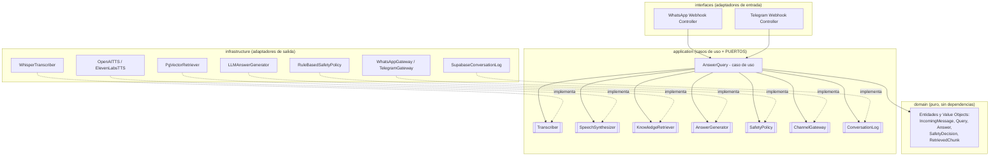
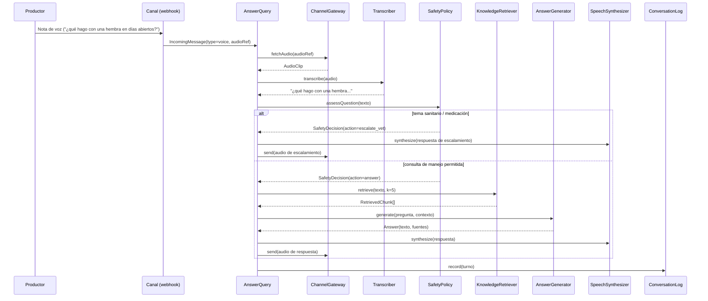

# Arquitectura — Asistente Porcícola de Voz (MVP "Wedge")

> **Propósito de este documento.** Es la especificación de arquitectura para la **primera versión** del producto. Está escrito para que un agente de código (Claude Code) pueda generar el esqueleto y la implementación inicial sin ambigüedad, y para que el equipo pueda **mantener y extender** el sistema después sin reescribirlo. Si una decisión no está aquí, se resuelve respetando los principios de la sección 3.

---

## 1. Contexto y decisión de alcance

El problema raíz validado es de **acceso a criterio técnico**: el porcicultor pequeño/mediano no tiene un mecanismo accesible, continuo y confiable que ponga conocimiento porcícola a su alcance en el día a día.

De todas las piezas posibles (dashboard, monitoreo de datos, matching de ventas), esta primera versión ataca **solo el filo más angosto y de mayor certeza**: un **asistente de conocimiento por voz** que responde preguntas de manejo sin exigirle datos al productor.

**Por qué este wedge y no el sistema completo:**

- Valida las dos hipótesis más caras (¿el productor lo usa? ¿confía en la recomendación?) **antes** de construir pipelines de datos.
- No depende de que el usuario registre nada — evita la contradicción central "el sistema necesita el dato, pero el usuario no genera el dato".
- **Voz primero** reduce la barrera de escolaridad: el usuario manda una nota de audio y recibe una nota de audio.

### 1.1 Dentro del alcance (MVP)

- Recibir mensajes de **texto y de voz** por un canal de mensajería (WhatsApp / Telegram).
- Transcribir voz → texto (STT).
- Recuperar conocimiento relevante de una **base curada** (RAG).
- Generar una respuesta en español, aterrizada al contexto colombiano.
- Responder **en el mismo formato del input** (audio → audio, texto → texto).
- Guardrails de seguridad: acotar el alcance y **escalar a veterinario** en temas sanitarios/medicación.
- Registro mínimo de conversaciones para métricas (nº de granjas asesoradas, preguntas frecuentes).

### 1.2 Fuera del alcance (explícito — no construir todavía)

- Dashboard web y analítica.
- Registro/monitoreo de datos productivos del usuario (consumos, condición corporal, días abiertos).
- Matching de compra/venta.
- Cuentas de usuario, login, roles.
- App móvil nativa.
- Fine-tuning o modelos propios.

> Estas exclusiones **no son olvidos**: son deuda intencional. La sección 17 describe cómo se agregan sin romper el núcleo.

---

## 2. Vista de 10 segundos

```
Nota de voz del productor (WhatsApp)
        │
        ▼
[Canal] → [Transcripción] → [Guardrails] → [Recuperación RAG] → [Generación LLM] → [Síntesis de voz] → Respuesta de audio
                                   │
                                   └─(si es tema sanitario/medicación)→ respuesta de escalamiento a veterinario
```

Todo lo que está entre corchetes es un **puerto** (interfaz). Cada implementación concreta (Whisper, Meta Cloud API, un LLM, pgvector) es un **adaptador** intercambiable.

---

## 3. Principios de diseño

Estos principios son **vinculantes**. Cualquier PR se revisa contra ellos.

### 3.1 Arquitectura hexagonal (puertos y adaptadores)

El **dominio y los casos de uso no importan ni conocen** frameworks, proveedores ni protocolos. El mundo exterior entra y sale por **puertos** (interfaces TypeScript). Esto es lo que hace que el sistema sea mantenible y extensible: cambiar de Telegram a WhatsApp, o de un proveedor de LLM a otro, es escribir un adaptador nuevo, **sin tocar la lógica de negocio**.

### 3.2 SOLID, aterrizado a este proyecto

| Principio                         | Cómo se aplica aquí                                                                                                                                                                                     |
| --------------------------------- | ------------------------------------------------------------------------------------------------------------------------------------------------------------------------------------------------------- |
| **S** — Responsabilidad única     | Cada clase hace una cosa: `Transcriber` solo transcribe, el caso de uso `AnswerQuery` solo orquesta, el controller solo traduce el webhook. Nada mezcla HTTP con lógica de negocio.                     |
| **O** — Abierto/cerrado           | Agregar un canal (WhatsApp) o un proveedor (otro TTS) se hace **añadiendo** un adaptador que implementa el puerto, sin **modificar** el núcleo ni los demás adaptadores.                                |
| **L** — Sustitución de Liskov     | Cualquier implementación de un puerto es intercambiable. Un `FakeTranscriber` en tests se comporta como el real frente al caso de uso.                                                                  |
| **I** — Segregación de interfaces | Puertos pequeños y enfocados (`Transcriber`, `SpeechSynthesizer`, `KnowledgeRetriever`…) en lugar de una interfaz "gorda". Un adaptador implementa solo lo que le corresponde.                          |
| **D** — Inversión de dependencias | El caso de uso depende de **abstracciones** (puertos), nunca de clases concretas. Las dependencias se **inyectan por constructor**. El cableado ocurre en un único lugar (composition root, sección 7). |

### 3.3 Reglas de código limpio (no negociables)

- **TypeScript estricto** (`strict: true`). Nada de `any` implícito.
- **Sin lógica de negocio en adaptadores.** Un adaptador traduce formatos; no decide.
- **Sin dependencias "hacia adentro".** El dominio no importa infraestructura. La regla de dependencia siempre apunta hacia el centro: `interfaces → application → domain`. Infraestructura implementa puertos definidos en `application`.
- **Errores explícitos.** Se usa un tipo `Result<T, E>` para flujos esperables (transcripción vacía, sin resultados de RAG) y excepciones solo para fallos inesperados. Nada de `throw` para control de flujo normal.
- **Funciones pequeñas, nombres reveladores**, sin comentarios que expliquen _qué_ hace el código (que lo diga el nombre); comentarios solo para el _por qué_ cuando no es obvio.
- **Inmutabilidad por defecto** en objetos de dominio (value objects `readonly`).
- **Configuración validada al arranque** (si falta una env var, el proceso no levanta).
- **Lenguaje ubicuo:** identificadores técnicos en inglés; términos del dominio que son más claros en español se conservan (`porcicultor`, `diasAbiertos`) y se documentan en un glosario.

---

## 4. Vista de componentes



La flecha clave: **application define los puertos, infrastructure los implementa**. La dependencia se invierte (D de SOLID).

---

## 5. Flujo principal (caso de uso `AnswerQuery`)



**Regla de formato de salida:** si el input fue voz, la respuesta es voz (+ opcionalmente el texto). Si fue texto, es texto. La decisión vive en el caso de uso, no en el adaptador.

---

## 6. Estructura de carpetas

```
src/
├── domain/                      # Núcleo puro. Cero imports de infraestructura o librerías externas.
│   ├── message/
│   │   ├── incoming-message.ts  # Value object: canal, usuario, tipo (text|voice), payload
│   │   └── outgoing-message.ts
│   ├── query/
│   │   ├── query.ts             # Value object: pregunta normalizada + locale
│   │   └── answer.ts            # Answer: texto + fuentes + deliverAs
│   ├── knowledge/
│   │   └── retrieved-chunk.ts   # Fragmento recuperado + score + metadata
│   ├── safety/
│   │   └── safety-decision.ts   # allowed, action (answer|escalate_vet|refuse), reason
│   └── shared/
│       └── result.ts            # Result<T, E> (ok/err)
│
├── application/                 # Casos de uso + definición de PUERTOS. Depende solo de domain.
│   ├── ports/                   # Interfaces (contratos). Ver sección 8.
│   │   ├── transcriber.ts
│   │   ├── speech-synthesizer.ts
│   │   ├── knowledge-retriever.ts
│   │   ├── embedder.ts
│   │   ├── answer-generator.ts
│   │   ├── safety-policy.ts
│   │   ├── channel-gateway.ts
│   │   └── conversation-log.ts
│   └── use-cases/
│       └── answer-query.ts      # Orquesta el flujo de la sección 5. Recibe puertos por constructor.
│
├── infrastructure/              # Adaptadores. Implementan puertos de application. Aquí viven las libs externas.
│   ├── speech/
│   │   ├── whisper-transcriber.ts
│   │   └── tts-synthesizer.ts
│   ├── llm/
│   │   ├── llm-answer-generator.ts
│   │   └── llm-embedder.ts
│   ├── knowledge/
│   │   └── pgvector-retriever.ts
│   ├── safety/
│   │   └── rule-based-safety-policy.ts
│   ├── channels/
│   │   ├── whatsapp-gateway.ts
│   │   └── telegram-gateway.ts
│   └── persistence/
│       └── supabase-conversation-log.ts
│
├── interfaces/                  # Adaptadores de ENTRADA (HTTP). Traducen webhooks a IncomingMessage.
│   └── http/
│       ├── server.ts            # Arranque del servidor (Express/Fastify) — delgado
│       ├── whatsapp-webhook.ts
│       └── telegram-webhook.ts
│
├── config/                      # Composition root + configuración validada.
│   ├── env.ts                   # Lectura + validación (zod) de variables de entorno
│   └── container.ts             # Cableado de dependencias (única fábrica de adaptadores)
│
└── shared/                      # Cross-cutting: logging, errores base.
    ├── logger.ts
    └── errors.ts

scripts/
└── ingest-knowledge.ts          # Pipeline OFFLINE de ingestión del corpus (sección 12). No es runtime.

test/
├── domain/                      # Tests unitarios del dominio (sin mocks — es puro)
├── application/                 # Tests del caso de uso con adaptadores fake (in-memory)
└── infrastructure/              # Tests de integración de cada adaptador
```

**Por qué esta separación importa para el mantenimiento:** cuando alguien quiera agregar WhatsApp, sabe exactamente dónde va (`infrastructure/channels/` + `interfaces/http/`) y sabe que **no debe tocar** `domain/` ni `application/`. La estructura enseña la regla.

---

## 7. Composition root (inyección de dependencias)

Un único lugar (`config/container.ts`) construye los adaptadores concretos y los inyecta en el caso de uso. **Es el único archivo que conoce las clases concretas.** No usamos un framework de DI: una función fábrica basta y es más legible.

```ts
// config/container.ts (ilustrativo)
export function buildAnswerQuery(env: Env): AnswerQuery {
  const transcriber = new WhisperTranscriber(env.OPENAI_API_KEY);
  const synthesizer = new TtsSynthesizer(env.TTS_API_KEY);
  const embedder = new LlmEmbedder(env.OPENAI_API_KEY);
  const retriever = new PgVectorRetriever(supabaseClient(env), embedder);
  const generator = new LlmAnswerGenerator(env.LLM_API_KEY);
  const safetyPolicy = new RuleBasedSafetyPolicy();
  const conversationLog = new SupabaseConversationLog(supabaseClient(env));

  // El gateway se resuelve por canal en el webhook; ver nota abajo.
  return new AnswerQuery({
    transcriber,
    synthesizer,
    retriever,
    generator,
    safetyPolicy,
    conversationLog,
  });
}
```

> El `ChannelGateway` es específico del canal que recibió el mensaje, así que el webhook selecciona el gateway correcto y lo pasa al caso de uso en la invocación (o se resuelve por un `ChannelGatewayResolver`). Esto mantiene el caso de uso agnóstico del canal.

---

## 8. Puertos (contratos)

Estas firmas son el corazón de la especificación. Un agente de código debe implementar **adaptadores que las cumplan**. Tipos auxiliares (`AudioClip`, `Locale`, etc.) van en `domain/`.

```ts
// application/ports/channel-gateway.ts
export interface ChannelGateway {
  fetchAudio(ref: AudioReference): Promise<Result<AudioClip, ChannelError>>;
  send(message: OutgoingMessage): Promise<Result<void, ChannelError>>;
}

// application/ports/transcriber.ts
export interface Transcriber {
  transcribe(audio: AudioClip): Promise<Result<Transcript, TranscriberError>>;
}
// Transcript = { text: string; language: Locale; confidence: number }

// application/ports/speech-synthesizer.ts
export interface SpeechSynthesizer {
  synthesize(text: string, opts: SynthesisOptions): Promise<Result<AudioClip, SynthesisError>>;
}
// SynthesisOptions = { locale: Locale; voice?: string }

// application/ports/embedder.ts  (usado por el retriever en runtime y por el script de ingestión)
export interface Embedder {
  embed(text: string): Promise<number[]>;
}

// application/ports/knowledge-retriever.ts
export interface KnowledgeRetriever {
  retrieve(query: string, k: number): Promise<RetrievedChunk[]>;
}
// RetrievedChunk = { id, content, source, score, metadata: { topic, validatedBy, updatedAt } }

// application/ports/answer-generator.ts
export interface AnswerGenerator {
  generate(input: GenerationInput): Promise<Result<GeneratedAnswer, GenerationError>>;
}
// GenerationInput  = { question: string; context: RetrievedChunk[]; locale: Locale; history?: Turn[] }
// GeneratedAnswer  = { text: string; usedSources: KnowledgeReference[] }

// application/ports/safety-policy.ts
export interface SafetyPolicy {
  assessQuestion(question: string): SafetyDecision; // pre-generación (síncrona, barata)
  reviewAnswer(question: string, draft: string): SafetyDecision; // post-generación (opcional en MVP)
}

// application/ports/conversation-log.ts
export interface ConversationLog {
  record(turn: ConversationTurn): Promise<void>;
}
```

**Nota sobre `SafetyPolicy`:** en el MVP es basada en reglas/palabras clave (medicación, dosis, síntomas de enfermedad, mortalidad súbita → `escalate_vet`). Es un puerto para que después se pueda reemplazar por un clasificador más sofisticado **sin tocar el caso de uso**. Este puerto no es opcional: es el guardrail que evita que una alucinación mate una hembra o una camada (sección 11).

---

## 9. Modelo de dominio (resumen)

Objetos inmutables, sin comportamiento de infraestructura:

- **`IncomingMessage`** — `{ channel, channelUserId, type: 'text'|'voice', text?, audioRef?, receivedAt }`
- **`OutgoingMessage`** — `{ channel, channelUserId, type: 'text'|'voice', text, audio? }`
- **`Query`** — pregunta normalizada + `locale`.
- **`Answer`** — `{ text, sources, deliverAs: 'text'|'voice' }`.
- **`RetrievedChunk`** — fragmento del corpus + `score` + metadata (fuente, validado por, fecha).
- **`SafetyDecision`** — `{ allowed, action: 'answer'|'escalate_vet'|'refuse', reason }`.
- **`ConversationTurn`** — para métricas: `{ channelUserId (hash), questionText, answerText, action, latencyMs, createdAt }`.

> **Privacidad:** el identificador del usuario se almacena **hasheado**. No guardamos el número de teléfono en claro. No se guarda audio crudo más allá de lo necesario para procesarlo.

---

## 10. Stack tecnológico (decisiones concretas para el MVP)

| Capa              | Elección                                                     | Razón                                                                                              |
| ----------------- | ------------------------------------------------------------ | -------------------------------------------------------------------------------------------------- |
| Lenguaje          | **Node.js + TypeScript `strict`**                            | Ya es el lenguaje de trabajo; unifica stack; tipado fuerte sostiene los contratos de puertos.      |
| HTTP              | **Fastify** (o Express)                                      | Delgado; solo expone webhooks. Es un adaptador de entrada → framework intercambiable.              |
| Canal (piloto)    | **WhatsApp Business Cloud API (Meta)**                       | Es donde **ya está** el productor rural; soporta recibir/enviar audio; tier gratuito para validar. |
| Canal (dev/test)  | **Telegram Bot API**                                         | Fricción cero para probar el pipeline internamente antes de la aprobación de Meta.                 |
| STT               | **Whisper API**                                              | Excelente en español; robusto a acentos y ruido de campo.                                          |
| TTS               | **OpenAI TTS** o **ElevenLabs**                              | Voz natural en español. Detrás de puerto → intercambiable.                                         |
| LLM               | **API de un LLM con buen español** (Claude / GPT) vía puerto | Sin fine-tuning: el valor está en el RAG, no en el modelo.                                         |
| Embeddings        | `text-embedding-3-small` (o multilingüe)                     | Barato, suficiente para el corpus inicial.                                                         |
| Vector store + DB | **Supabase (Postgres + pgvector)**                           | Corpus vectorizado y logs en un solo servicio; sin infra separada.                                 |
| Validación        | **zod**                                                      | Valida webhooks y configuración; falla temprano y claro.                                           |
| Logging           | **pino**                                                     | Estructurado (JSON), bajo overhead.                                                                |
| Tests             | **vitest** + adaptadores fake                                | Rápido, TS-native.                                                                                 |
| Lint/format       | **ESLint + Prettier**                                        | Consistencia automática.                                                                           |

> Ninguna de estas librerías aparece en `domain/` ni en `application/`. Todas viven en `infrastructure/`, `interfaces/` o `config/`.

---

## 11. Seguridad y alcance (guardrails) — no es opcional

El sistema aconseja sobre **animales vivos**. Una recomendación errónea puede costar una hembra o una camada — capital irreemplazable para este productor. Reglas de diseño:

1. **Alcance acotado explícito.** El prompt del sistema define qué **sí** aconseja (manejo reproductivo general, alimentación, condición corporal, prácticas de crianza) y qué **no** (diagnóstico clínico, prescripción de medicamentos, dosis).
2. **Escalamiento obligatorio.** `SafetyPolicy.assessQuestion` detecta temas sanitarios/medicación/mortalidad y responde con un mensaje que remite a un veterinario, **sin intentar** dar la respuesta técnica.
3. **Nunca dosis sin guardarraíles.** Cualquier mención de dosis de fármacos → escalamiento, no cálculo.
4. **Grounding obligatorio.** El generador responde **solo** con base en el contexto recuperado del corpus curado; si no hay contexto suficiente, dice que no sabe y sugiere consultar un técnico. Reduce alucinaciones.
5. **Trazabilidad.** Cada respuesta registra qué fragmentos del corpus usó (para auditar con un zootecnista).
6. **Descargo claro.** El bot se presenta como apoyo, no como reemplazo de un veterinario.

Estos puntos se traducen en tests: hay un set de preguntas "trampa" (medicación, síntomas) que **deben** producir `escalate_vet`.

---

## 12. Base de conocimiento e ingestión (el foso real)

La diferenciación **no** está en el LLM (que ya sabe de porcicultura genérica), sino en un **corpus curado, validado por un zootecnista y específico para Colombia** (razas, clima, costos, normativa ICA). Su construcción es trabajo real y necesita dueño.

**Pipeline offline (`scripts/ingest-knowledge.ts`), separado del runtime:**

```
Fuentes curadas (.md / .pdf validados por zootecnista)
   → normalizar a texto
   → chunking (semántico, ~300–500 tokens, con solape)
   → embed(chunk) vía puerto Embedder
   → upsert en pgvector con metadata:
        { source, topic, validatedBy, updatedAt, region: 'CO' }
```

Reglas:

- Cada documento fuente lleva **procedencia y validador** en su metadata. Solo entra al corpus lo validado.
- El script es **idempotente** (re-ejecutable sin duplicar) y versionable.
- Reutiliza el mismo puerto `Embedder` que el runtime → un solo lugar decide cómo se embeben los textos (consistencia).

Esquema mínimo (Postgres/pgvector):

```sql
create table knowledge_chunk (
  id          uuid primary key default gen_random_uuid(),
  content     text not null,
  embedding   vector(1536),
  source      text not null,
  topic       text,
  validated_by text,
  region      text default 'CO',
  updated_at  timestamptz default now()
);
create index on knowledge_chunk using ivfflat (embedding vector_cosine_ops);
```

---

## 13. Configuración y entorno

`config/env.ts` valida con zod al arranque. Si falta algo, **el proceso no levanta** (fail-fast). Variables:

```
# Canal
WHATSAPP_TOKEN=
WHATSAPP_PHONE_NUMBER_ID=
WHATSAPP_VERIFY_TOKEN=
TELEGRAM_BOT_TOKEN=          # opcional (dev/test)

# IA
LLM_PROVIDER=anthropic|openai
LLM_API_KEY=
STT_API_KEY=
TTS_PROVIDER=openai|elevenlabs
TTS_API_KEY=
EMBEDDINGS_API_KEY=

# Datos
SUPABASE_URL=
SUPABASE_SERVICE_KEY=

# App
PORT=3000
LOG_LEVEL=info
ACTIVE_CHANNEL=whatsapp|telegram
```

Nunca se commitean secretos. Hay un `.env.example` con las llaves sin valores.

---

## 14. Manejo de errores y resiliencia

- **`Result<T, E>`** para fallos esperables; excepciones solo para bugs.
- **Degradación elegante:** si TTS falla, se envía la respuesta en **texto** (no se pierde la interacción). Si STT falla, se pide reenviar el audio o escribir.
- **Timeouts y reintentos** con backoff en llamadas a APIs externas (STT/LLM/TTS), encapsulados en el adaptador, invisibles para el caso de uso.
- **Idempotencia de webhooks:** los proveedores reintentan; se deduplica por `messageId`.
- **Nunca romper el webhook:** el controller responde `200` rápido y procesa; los errores se loguean, no se propagan al proveedor.

---

## 15. Observabilidad y métrica de éxito

- **Logging estructurado** (pino) con `correlationId` por mensaje.
- **Métrica de éxito primaria** (del entregable): **nº de granjas/productores asesorados** con uso recurrente. Se deriva de `ConversationLog`.
- **Métricas secundarias:** preguntas más frecuentes (guía el corpus), tasa de escalamiento a vet, latencia por etapa, tasa de "no sé" (indica huecos del corpus), retención semanal.
- Preparado para enviar eventos a **PostHog** cuando se agregue (adaptador nuevo del puerto `ConversationLog` o un puerto `AnalyticsSink` separado).

---

## 16. Estrategia de pruebas

La arquitectura hace el testing barato **por diseño**:

- **Dominio:** tests unitarios puros, sin mocks (es lógica pura).
- **Caso de uso (`AnswerQuery`):** se prueba con **adaptadores fake in-memory** (`FakeTranscriber`, `FakeRetriever`, etc.). Se verifican los flujos: voz→voz, texto→texto, escalamiento a vet, sin resultados de RAG. Esto es posible **porque** las dependencias son puertos inyectados (D de SOLID).
- **Adaptadores:** tests de integración contra los servicios reales (o sandbox).
- **Guardrails:** suite dedicada de preguntas sensibles que deben escalar.
- **Meta de cobertura:** dominio y application cerca del 100%; infraestructura, los caminos críticos.

---

## 17. Ruta de extensión (cómo crece sin reescribirse)

Cada evolución futura ya tiene su lugar, gracias a los puertos:

| Quiero agregar…                                           | Qué hago                                                                                  | Qué NO toco                  |
| --------------------------------------------------------- | ----------------------------------------------------------------------------------------- | ---------------------------- |
| **Otro canal** (WhatsApp además de Telegram, o Instagram) | Nuevo adaptador en `infrastructure/channels/` + webhook en `interfaces/http/`             | `domain/`, `application/`    |
| **Registro de datos productivos** (fase 2)                | Nuevo caso de uso `LogProductionData` + puerto `ProductionRepository`; el canal ya existe | El caso de uso `AnswerQuery` |
| **Humano en el loop** (técnico que respalda)              | Nuevo puerto `HumanReviewQueue`; `SafetyPolicy` puede encolar en vez de responder         | Adaptadores de IA existentes |
| **Cambiar de proveedor de LLM/TTS/STT**                   | Nuevo adaptador que implementa el mismo puerto + cambio en el container                   | Todo lo demás                |
| **Dashboard / analítica**                                 | Nuevo servicio que lee de `ConversationLog`/`ProductionRepository`                        | El backend del bot           |
| **Matching de ventas** (otra oportunidad)                 | Nuevo bounded context / módulo aparte que reutiliza canal y patrón hexagonal              | Este módulo                  |

La regla que garantiza esto: **agregar = escribir un adaptador nuevo; nunca modificar el núcleo.** (O de SOLID.)

---

## 18. Roadmap por fases

- **Fase 0 — Esqueleto:** estructura de carpetas, puertos definidos, caso de uso con **adaptadores fake**, tests verdes. El flujo corre end-to-end en memoria. _(Lo que Claude Code genera primero.)_
- **Fase 1 — Pipeline real por Telegram:** adaptadores reales (Whisper, TTS, LLM, pgvector, Telegram). Corpus semilla pequeño validado. Prueba interna voz→voz.
- **Fase 2 — Piloto WhatsApp:** adaptador WhatsApp Cloud API + guardrails afinados + métricas en `ConversationLog`. Pilotos con un grupo reducido de productores (valida H3 y H4).
- **Fase 3 en adelante:** según tracción — datos productivos, humano en el loop, dashboard.

---

## 19. Cómo arrancar (para el agente de código)

Orden sugerido de construcción:

1. Scaffolding: `package.json`, `tsconfig` (`strict`), ESLint/Prettier, vitest, estructura de carpetas de la sección 6.
2. `domain/` completo (value objects + `Result`).
3. `application/ports/` (todas las interfaces de la sección 8).
4. `application/use-cases/answer-query.ts` con dependencias inyectadas.
5. Tests del caso de uso con **adaptadores fake** → deben pasar (Fase 0 lista).
6. `config/env.ts` y `config/container.ts`.
7. Un adaptador real por puerto, empezando por **Telegram** (más simple) para validar el pipeline.
8. `scripts/ingest-knowledge.ts` + esquema pgvector.
9. Webhook HTTP delgado en `interfaces/http/`.
10. Guardrails (`RuleBasedSafetyPolicy`) + su suite de tests.

---

## 20. Convenciones de código

- **Nombres:** clases `PascalCase`, funciones/variables `camelCase`, archivos `kebab-case.ts`.
- **Un export principal por archivo.**
- **Imports ordenados**: dominio → aplicación → infraestructura (nunca al revés).
- **Sin números/strings mágicos**: constantes con nombre.
- **Commits** en formato convencional (`feat:`, `fix:`, `refactor:`, `test:`).
- **Definition of Done** de cada pieza: tipada, con test, sin `any`, lint limpio, respeta la regla de dependencia.

---

### Glosario (lenguaje ubicuo)

- **Porcicultor de cría** — usuario objetivo; opera una granja de <500 madres.
- **Días abiertos** — periodo tras el destete en que la hembra no está gestante.
- **Condición corporal** — estado nutricional de la hembra (muy flaca / en rango / muy gorda).
- **Pie de cría** — conjunto de hembras reproductoras.
- **Wedge** — el filo angosto por el que entra el producto: aquí, el asistente de conocimiento por voz.
- **Puerto / Adaptador** — interfaz del núcleo / su implementación concreta e intercambiable.
